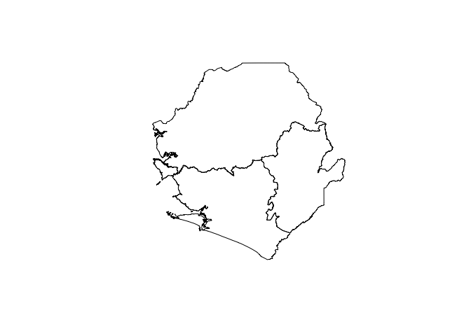
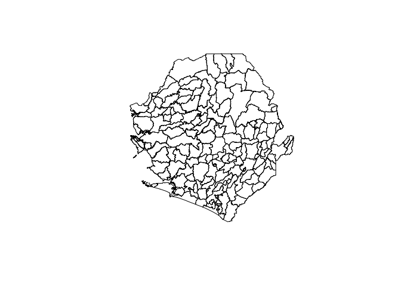
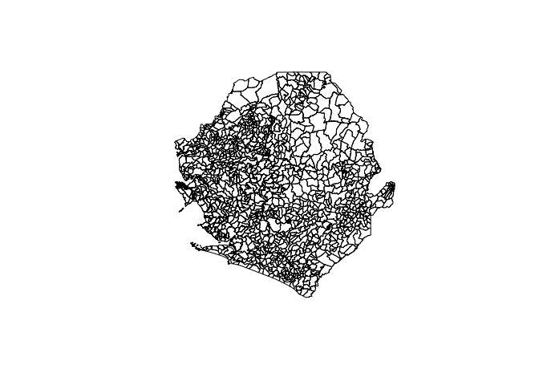

<!-- README.md is generated from README.Rmd. Please edit that file -->

# sierraleone: Datasets for use in designing surveys in Sierra Leone 

<!-- badges: start -->

[](https://www.tidyverse.org/lifecycle/#maturing)
[](https://travis-ci.org/spatialworks/sierraleone)
[](https://ci.appveyor.com/project/spatialworks/sierraleone)
<!-- badges: end -->

Designing surveys require relevant datasets to be used as basis for
sample size calculations, sampling design, survey planning/logistics and
survey implementation. These include datasets on population, lists of
sampling clusters, map datasets for spatial sampling, and previous
survey datasets that can be used for estimating indicator variance and
design effects. This package contains relevant datasets for use in
designing surveys in Sierra Leone.

## Installation

The `sierraleone` packages is not yet released on
[CRAN](https://cran.r-project.org). The development version of the
package can be installed from
[GitHub](https://github.com/spatialworks/sierraleone) with:

``` r
if(!require(remotes)) install.packages("remotes")
remotes::install_github("spatialworks/sierraleone")
```

## Usage

When installing `sierraleone`, geospatial packages on which
`sierraleone` depends on are installed. To use `sierraleone` package, it
will be important to load these package dependencies that have been
installed. This can be done by:

``` r
library(rgdal)
library(rgeos)
library(raster)
```

### Province borders

The Sierra Leone province borders `SpatialPolygonsDataFrame` is accessed
via the `province` dataset.

``` r
sierraleone::province
#> class       : SpatialPolygonsDataFrame 
#> features    : 4 
#> extent      : -13.30901, -10.27056, 6.923379, 9.999253  (xmin, xmax, ymin, ymax)
#> crs         : +proj=longlat +datum=WGS84 +no_defs +ellps=WGS84 +towgs84=0,0,0 
#> variables   : 13
#> names       : OBJECTID, admin1Name, admin1Pcod, admin1RefN, admin1AltN, admin1Al_1,   admin0Name, admin0Pcod,       date,    validOn, validTo,   Shape_Leng,      Shape_Area 
#> min values  :        1,    Eastern,       SL01,    Eastern,         NA,         NA, Sierra Leone,         SL, 2016/08/01, 2016/10/17,      NA, 1.8390606275, 0.0563871543411 
#> max values  :        4,    Western,       SL04,    Western,         NA,         NA, Sierra Leone,         SL, 2016/08/01, 2016/10/17,      NA, 12.645889079,   2.96657963229
```

The province borders of Sierra Leone can be plotted by:

``` r
sp::plot(sierraleone::province)
```



### District borders

The Sierra Leone district borders `SpatialPolygonsDataFrame` is accessed
via the `district` dataset.

``` r
sierraleone::district
#> class       : SpatialPolygonsDataFrame 
#> features    : 14 
#> extent      : -13.30901, -10.27056, 6.923379, 9.999253  (xmin, xmax, ymin, ymax)
#> crs         : +proj=longlat +datum=WGS84 +no_defs +ellps=WGS84 +towgs84=0,0,0 
#> variables   : 15
#> names       : OBJECTID,         admin2Name, admin2Pcod,         admin2RefN, admin2AltN, admin2Al_1, admin1Name, admin1Pcod,   admin0Name, admin0Pcod,       date,    validOn, ValidTo,     Shape_Leng,       Shape_Area 
#> min values  :        1,                 Bo,     SL0101,                 Bo,         NA,         NA,    Eastern,       SL01, Sierra Leone,         SL, 2016/08/01, 2016/10/17,      NA, 0.738326560804, 0.00606880539992 
#> max values  :        9, Western Area Urban,     SL0402, Western Area Urban,         NA,         NA,    Western,       SL04, Sierra Leone,         SL, 2016/08/01, 2016/10/17,      NA,  6.84446934587,    1.01774343267
```

The district borders of Sierra Leone can be plotted by:

``` r
sp::plot(sierraleone::district)
```


### Chiefdom borders

The Sierra Leone chiefdom borders `SpatialPolygonsDataFrame` is accessed
via the `chiefdom` dataset.

``` r
sierraleone::chiefdom
#> class       : SpatialPolygonsDataFrame 
#> features    : 167 
#> extent      : -13.30901, -10.27056, 6.923379, 9.999253  (xmin, xmax, ymin, ymax)
#> crs         : +proj=longlat +datum=WGS84 +no_defs +ellps=WGS84 +towgs84=0,0,0 
#> variables   : 19
#> names       : OBJECTID, admin3Name, admin3Pcod, admin3RefN,         admin2Name, admin2Pcod, admin1Name, admin1Pcod,   admin0Name, admin0Pcod,       date,    validOn, validTo,      Shape_Leng,        Shape_Area, ... 
#> min values  :        1,     Badjia,   SL010101,     Badjia,                 Bo,     SL0101,    Eastern,       SL01, Sierra Leone,         SL, 2016/08/01, 2016/10/17,      NA, 0.0487843097851, 6.51303509621e-05, ... 
#> max values  :       99, York Rural,   SL040208, York Rural, Western Area Urban,     SL0402,    Western,       SL04, Sierra Leone,         SL, 2016/08/01, 2016/10/17,      NA,   2.76373793498,    0.202641459488, ...
```

The chiefdom borders of Sierra Leone can be plotted by:

``` r
sp::plot(sierraleone::chiefdom)
```



### County borders

The Sierra Leone county borders `SpatialPolygonsDataFrame` is accessed
via the `county` dataset.

``` r
sierraleone::county
#> class       : SpatialPolygonsDataFrame 
#> features    : 1316 
#> extent      : -13.30901, -10.27056, 6.923379, 9.999253  (xmin, xmax, ymin, ymax)
#> crs         : +proj=longlat +datum=WGS84 +no_defs +ellps=WGS84 +towgs84=0,0,0 
#> variables   : 24
#> names       : OBJECTID, admin4Name, admin4Pcod, admin4RefN, admin4AltN, admin4Al_1, admin3Name, admin3Pcod,         admin2Name, admin2Pcod, admin1Name, admin1Pcod,   admin0Name, admin0Pcod,       date, ... 
#> min values  :        1,   Aberdeen, SL01010101,   Aberdeen,         NA,         NA,     Badjia,   SL010101,                 Bo,     SL0101,    Eastern,       SL01, Sierra Leone,         SL, 2016/08/01, ... 
#> max values  :      999,     Zone 7, SL04020810,     Zone 7,         NA,         NA, York Rural,   SL040208, Western Area Urban,     SL0402,    Western,       SL04, Sierra Leone,         SL, 2016/08/01, ...
```

The county borders of Sierra Leone can be plotted by:

``` r
sp::plot(sierraleone::county)
```


